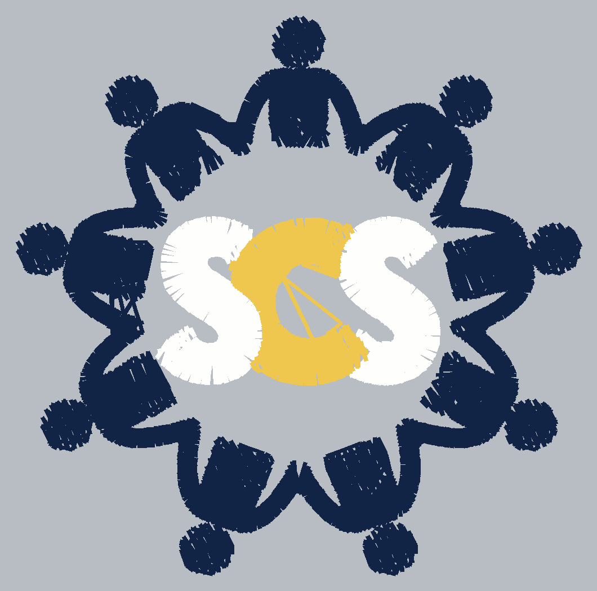

# StitchForge

Upload an image — or type text — and get a machine-ready embroidery file.
The original StitchForge digitizing pipeline (colour separation → satin
columns + tatami fills → QA + auto-tune) wrapped in a web UI, with the
Ink/Stitch family of projects integrated end to end.



## Run it

```bash
./run.sh            # then open http://localhost:8000
```

Or manually:

```bash
python3 -m venv .venv && source .venv/bin/activate
pip install -r requirements.txt
uvicorn app:app --reload --port 8000
```

Tests: `pytest`.

## What you get

- **PNG → DST** — the digitizing pipeline described below, unchanged.
- **Any machine format** — exports via pystitch: DST, PES, JEF, EXP, VP3,
  XXX, U01, PEC, TBF, plus CSV/PNG.
- **Lettering** — type text, pick one of the bundled Ink/Stitch embroidery
  fonts, get satin-stitched letters (each glyph is a hand-digitized set of
  satin columns and running stitches, sewn by the rail-and-rung engine
  ported from Ink/Stitch).
- **Worksheet PDF** — a client overview page and an operator detailed view
  in the layout of Ink/Stitch's print worksheet, including thread names
  matched from real palettes (Madeira, Isacord, Gunold, Brother) and a
  quote sheet ported from embTools.
- **Previews** — raster preview, stitch-plan SVG, and Ink/Stitch's
  *realistic* preview (every stitch drawn as a lit thread via the
  feSpecularLighting filter), all in a pan/zoom viewer, plus a stitch
  player that sews the design on screen.

## Integrated projects

| Repo | How it's used here |
|---|---|
| [inkstitch/pystitch](https://github.com/inkstitch/pystitch) | Vendored at `third_party/pystitch` (MIT). All embroidery file I/O — DST writing and every export format. |
| [inkstitch/inkstitch](https://github.com/inkstitch/inkstitch) | Ported (GPL-3.0): realistic stitch rendering (`inkstitchlib/stitch_svg.py`, from `lib/svg/rendering.py`), the print worksheet as a PDF (`inkstitchlib/worksheet.py`, after `print/templates/`), satin rail/rung detection and glyph layout (`inkstitchlib/lettering.py`, from `lib/elements/satin_column.py` and `lib/lettering/`), thread palettes (`palettes/*.gpl`). |
| [inkstitch/embroidery-fonts](https://github.com/inkstitch/embroidery-fonts) | Seven fonts vendored under `fonts/` (each keeps its own licence file): Amitaclo, Emilio 20, Emilio 20 Simple, Geneva Simple Sans, Magnolia KOR, Pacificlo, Sacramarif. Add more by dropping a font directory (`font.json` + `ltr.svg`) into `fonts/`. |
| [inkstitch/embTools-1](https://github.com/inkstitch/embTools-1) | Feature port of the Qt app (GPL-3.0): the quote sheet calculation (`quotesheet.cpp` → `inkstitchlib/worksheet.quote`), the stitch player (UI ▶ Player mode), unit conversion (mm ⇄ inch widget). |
| [inkstitch/svg.panzoom.js](https://github.com/inkstitch/svg.panzoom.js) | Vendored at `static/vendor/svg.panzoom.js` (MIT, adapted to the global svg.js build) — pan/zoom for the stitch plan, realistic preview and player. svg.js itself is vendored alongside. |

## The digitizing pipeline

**1 · Colour separation** (`digitizer/segment.py`)
Alpha channel if present, otherwise the background colour is detected from
the image border and flooded out. The remaining pixels are k-means clustered
into the requested number of thread colours. Layers are ordered lightest to
darkest so darker outline colours sew last and cover the seams.

**2 · Stitch generation** (`digitizer/core.py`, `engine.py`)
For each colour layer, each connected shape is handled on its own:

- The shape's skeleton is extracted and pruned — terminal forks shorter than
  ~1.5× the local stroke width are artefacts, and satin-ing them makes a fan
  of crossed stitches.
- Each surviving branch becomes a satin column. The crossing angle is solved
  per stitch by rotating through ±40° and taking the *shortest* chord, so
  stitches cut the stroke on its true perpendicular instead of a diagonal.
- Spacing is paced off the **outer** edge of each curve; pacing off the
  centreline is what opens gaps on the outside of a bend.
- Any stroke wider than the satin cap breaks the column; those regions, plus
  anything the columns don't cover, get a tatami fill in the same thread,
  sewn first so the satin sits on top.
- Underlay: centre run + zigzag under every satin column; edge walk +
  cross-hatch under every fill.
- Travel is routed inside the shape where a straight line fits; remaining
  travels over the trim distance are cut by the machine.

**3 · Inspection and auto-tune** (`engine.qa_report`, `engine.digitize`)
The finished pattern is rasterised at true thread width and compared back
against the source masks: per-colour coverage, gap sizes, stitch length
range, travel count, finished size, hoop clearance. Then it acts:

| Finding | Action |
|---|---|
| Stitched width off target | rescale the canvas and rebuild |
| Longest stitch over the satin cap | lower the cap |
| Coverage under 96.5% | tighten density by 0.025 mm (floor 0.30) |
| Gap over 1.0 mm² | halve the minimum fill area so corners get stitched |

It loops up to four passes and stops as soon as a pass makes no changes.

## API

```
POST /api/analyze                image + colour count -> layers
POST /api/digitize               digitize an analyzed upload
POST /api/lettering              text + font -> stitched lettering
GET  /api/fonts                  bundled fonts (+ /api/fonts/{id}/preview.png)
GET  /api/palettes               thread palettes
GET  /api/download/{job}?fmt=    dst pes jef exp vp3 xxx u01 pec tbf csv json txt gcode png
GET  /api/plan/{job}.svg         stitch plan SVG (?realistic=true for the lit preview)
GET  /api/stitches/{job}         stitch blocks JSON (drives the player)
GET  /api/worksheet/{job}.pdf    print worksheet (quote params: setup, price_per_1000,
                                 garment_qty, garment_base, markup_pct, discount_pct)
```

## Layout

```
app.py                    FastAPI app
digitizer/                image -> colour layers -> stitches (the original core)
inkstitchlib/             everything ported from the Ink/Stitch family
  stitch_svg.py             stitch plan + realistic SVG rendering
  worksheet.py              print worksheet PDF + embTools quote sheet
  lettering.py              embroidery-fonts lettering engine
  threads.py                thread palette matching
fonts/                    vendored Ink/Stitch fonts (per-font licences inside)
palettes/                 vendored Ink/Stitch thread palettes (.gpl)
third_party/pystitch/     vendored pystitch (MIT)
static/                   UI; vendor/ holds svg.js + svg.panzoom.js
tests/                    end-to-end API tests
```

## Limits worth knowing

- Photographs won't digitize well — the artwork path wants flat-colour,
  vector-style art. Detail under about 1 mm can't be stitched at any density.
- DST carries no colour information; the thread list in the UI/worksheet is
  the sequence you follow at the machine.
- Each Ink/Stitch font only scales within its designed range (shown next to
  the font picker); the engine clamps to it.
- Jobs are written to a temp directory keyed by id, with no cleanup or auth.
  Add both before putting this anywhere public.

## Licence

GPL-3.0 (see `LICENSE`) — required by the code ported from Ink/Stitch and
embTools. Vendored components keep their own licences in their directories:
pystitch (MIT), svg.js / svg.panzoom.js (MIT), each font under `fonts/`
(SIL OFL or similar, see each `LICENSE`).
